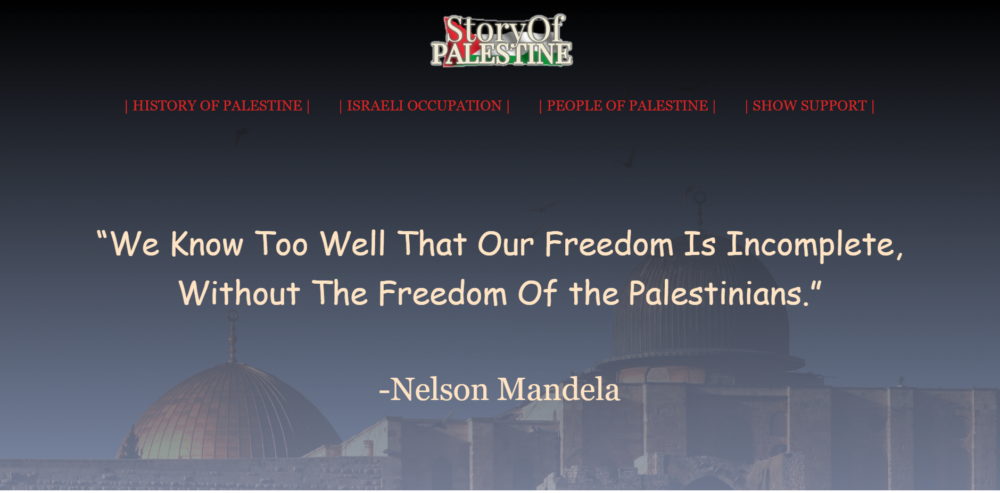
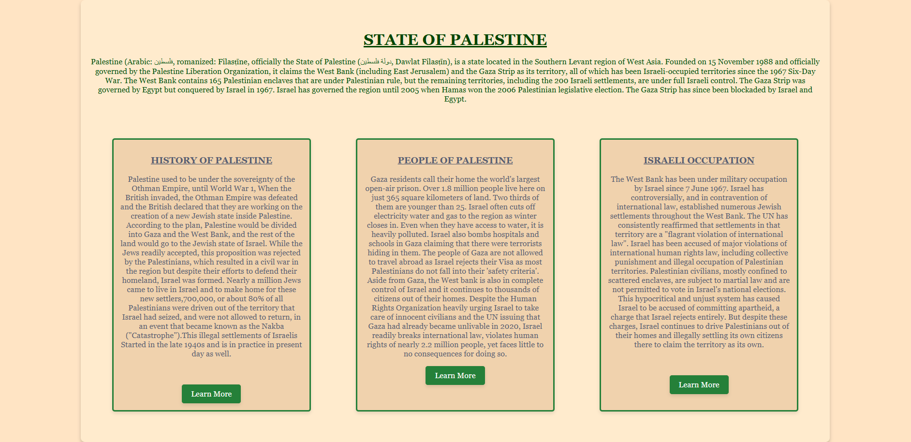
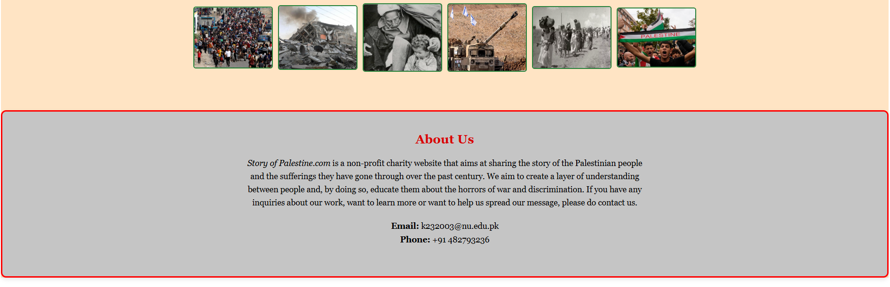
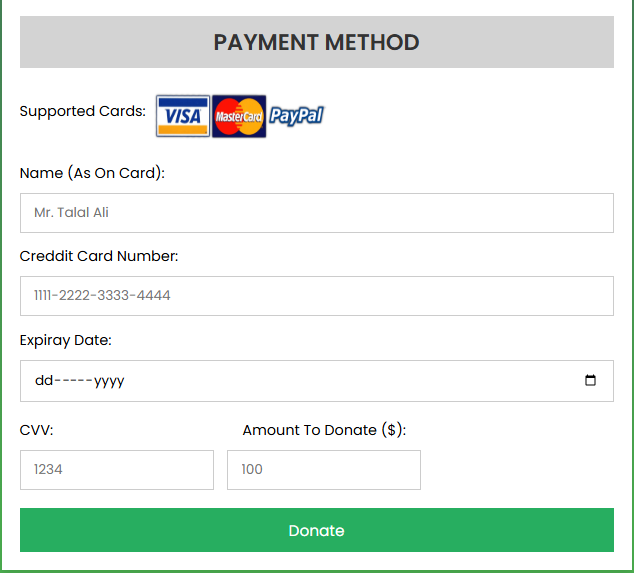
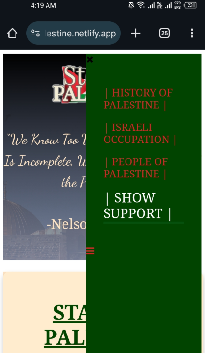

# 🌐 First Web Page Project

This is my **first website**, created using **HTML** and **CSS**. It includes basic styling, simple animations, and multiple pages with smooth navigation. The site is also **semi-responsive**, adjusting its layout for mobile screens.

---

## 🚀 Features

- ✅ **Homepage** with introductory content
- ✅ **Two informational pages** with styled text and layout
- ✅ **Donation page** with a working **donation form**
- ✅ **Basic animations**:
  - Text grows and changes color on hover
  - Buttons and links have simple interactive effects
- ✅ **Navigation bar** to switch between pages
- 📱 **Semi-responsive design**: Adjusts on smaller screens like mobile devices

---

## 🗂️ Project Structure

Story-of-Palestine.com/
├── screenshots/
│ ├── home_1.png
│ ├── home_2.png
│ ├── home_3.png
│ ├── donation.png
│ └── mobile.png
├── code/
└── README.md

---

## 📸 Screenshots

### 🏠 Home Page
  
  
  

### 💸 Donation Page

### 📱 Mobile View

---

## 📱 Responsiveness

The layout adapts to smaller screens like smartphones, making it **partially mobile-friendly**. As this is my first project, full responsiveness and polish are still a work in progress.

---

## 🛠️ Technologies Used

- **HTML5**
- **CSS3**
- Minimal **inline JavaScript**

---

## 📌 Notes

- This project is meant as a learning exercise to build foundational web design skills.
- Feedback and suggestions are always welcome!

---

## 🔗 Live Preview

👉 [View the site on Netlify](https://storyofpalestine.netlify.app/)

---
